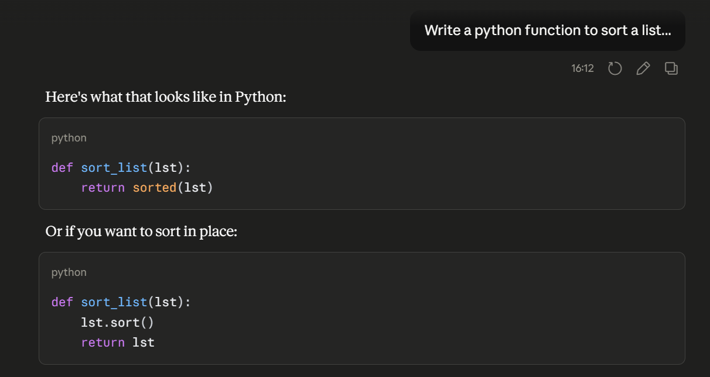
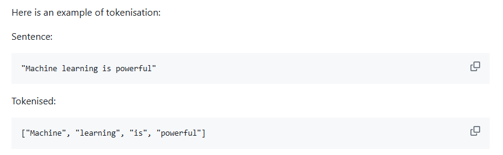
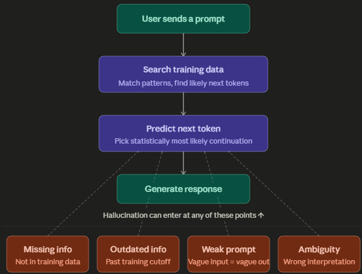
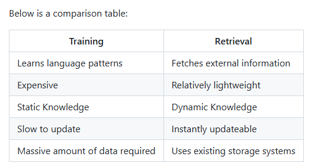

# LLMs and Data

## What is a Large Language Model?

A Large Language Model (LLM) is a machine learning model built to make predictions about language. Examples include:

- **ChatGPT** (OpenAI)
- **Claude** (Anthropic)
- **Gemini** (Google)

### Are LLMs just a big database?

No. An LLM doesn't look things up and return a stored answer. Instead, it follows this order of operations:

1. **Retrieve data**: Gather relevant context
2. **Inject context**: Add that context into the prompt
3. **Generate response**: Produce a response based on patterns learned during training

## Training

LLMs are trained on large amounts of text data, including:

- Documents and documentation
- Code and repositories
- Websites
- Articles and books

The common thread is **text**. LLMs learn statistical patterns across all of the examples shown, not facts to recall, but relationships between words and ideas.

## What is an LLM actually trying to do?

The goal is to **predict the next token(s) in a sequence**.

This is sometimes called **"prediction, not understanding"**. The model isn't reasoning or thinking, it's identifying patterns in language and generating the statistically most likely continuation. Computers aren't smart, they're very good at pattern matching at scale.

### Key jobs of an LLM

- Identify patterns in language
- Predict statistically likely responses
- Generate text token-by-token

## Prediction Examples

Because LLMs are prediction engines, they perform well on tasks where there's a clear statistically likely answer:

| Prompt | Predicted Output |
|---|---|
| "The capital city of France is..." | Paris |
| "The chemical symbol for water is..." | H2O |
| "To make a HTTP GET request in JavaScript, use..." | `fetch()` |
| "The `console.log()` function in JavaScript is used to..." | Output a message to the console |

**Claude prompt example**

These work because the correct answer appears overwhelmingly often in training data, the model has seen the pattern thousands of times.

## Tokens

A token is the basic unit the LLM works with. Tokens can be:

- Whole words (`"learning"`)
- Parts of words (`"un"`, `"believ"`, `"able"`)
- Punctuation (`"."`, `","`)
- Symbols (`"$"`, `"@"`)

### Tokenisation

Tokenisation is the process of splitting input text into these units before the model processes it.

**Example:**

Prompt: `"Machine learning is powerful"`

Tokens: `["Machine", " learning", " is", " powerful"]`

### Why do tokens matter?

Token count directly affects:

- **Cost**: Most APIs charge per token
- **Performance**: More tokens = more computation
- **Context limits**: You can only fit so many tokens in a context window
- **Latency**: Larger token counts take longer to process

## Context Window

The context window is the **maximum amount of text an LLM can "see" at one time**. This can include your prompt, any retrieved documents, and the conversation history. Once you exceed the context window, older content gets dropped.

### Ways to work around context window limits

- **RAG (Retrieval Augmented Generation)**: Only inject the most relevant documents rather than everything
- **Chunking**: Split large documents into smaller pieces and process them separately
- **Summarisation**: Compress earlier conversation history into a shorter summary to free up space
- **Fine-tuning**: Bake frequently needed knowledge into the model itself so it doesn't need to be passed in every time

## Hallucinations

A hallucination is when an LLM produces an inaccurate or fabricated response. This happens because the model is always predicting.

**Common causes**:

- **Missing information**: The answer wasn't well-represented in training data
- **Outdated information**: The model's training has a cutoff date
- **Weak prompt**: Vague or ambiguous input leads to vague output
- **Ambiguity**: The model picks a plausible interpretation that isn't the right one

## Training vs Retrieval

Training gives a model deep, stable knowledge baked in at scale, but it's expensive, slow to update, and frozen at a point in time. Retrieval keeps responses current and grounded in real data, but it depends on the quality of what it fetches.

## Why Does External Data Matter?

A lot of the most useful information an organisation has was never part of any model's training data:

- Internal documents and policies
- Product and customer data
- Support tickets and emails
- Recent events or decisions

This data is:
- **Not in the original training**: The model simply doesn't know it
- **Frequently changing**: Policies update, tickets are raised daily
- **Private**: It shouldn't be in a public training set anyway

To make an LLM useful with this kind of data, you need a way to feed it in at query time, this is where RAG comes in.

## RAG (Retrieval Augmented Generation)

RAG is a pattern that combines a retrieval system with an LLM, so the model can generate responses grounded in external or up-to-date information.

### Basic RAG flow

Rather than relying purely on what the model learned during training, RAG gives it the right information at the right moment, this keeps responses accurate, current, and specific to your data.

