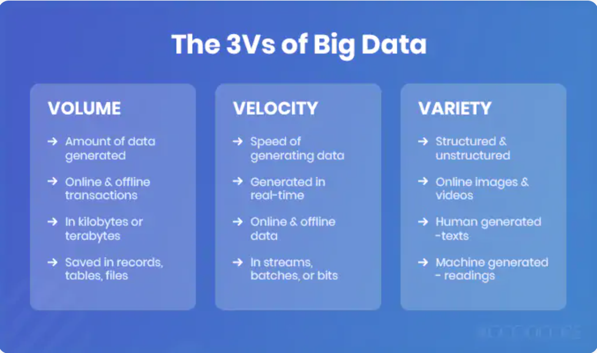
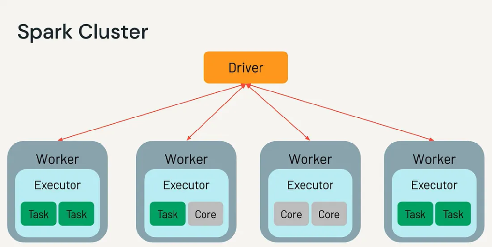
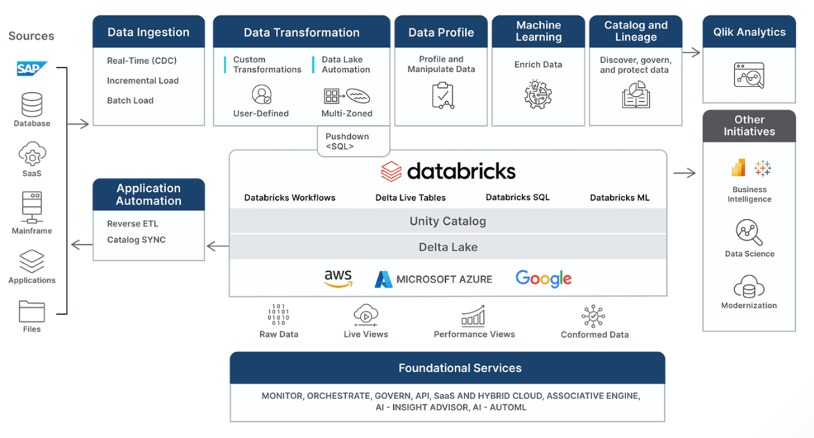

# Databricks and PySpark research

## Big Data

"Big Data" refers to datasets too large or complex for traditional tools to process effectively. It is typically defined by the **three Vs**:

- **Volume**: data measured in terabytes, petabytes, or beyond
- **Velocity**: data arriving continuously or in real time (e.g. transactions)
- **Variety**: structured (tables), semi-structured (JSON, XML), and unstructured (images, video, text)



## OLTP (Online Transaction Processing)

OLTP systems are designed to handle large numbers of short and fast operations, things like inserting, updating, and deleting individual records.

**Typical use cases:**
- Banking transactions
- E-commerce orders
- Booking systems

**Key characteristics:**
- Optimised for writes and quick lookups
- Handles many concurrent users
- Data is split across many tables to avoid repetition (e.g. customer addresses in one table, orders in another, linked by ID)
- Stores data row by row, fast for individual record operations, but slow for scanning large amounts of data

> A traditional relational database like MySQL or PostgreSQL is a classic OLTP system.

## ACID

ACID is a set of properties that guarantee database transactions are processed reliably. It is the backbone of OLTP systems.

- **Atomicity**: If one transaction fails, the whole thing rolls back (e.g. money leaves one account but never arrives in another, then the whole transfer is cancelled)
- **Consistency**: A transaction can only bring the database from one valid state to another. No broken rules or constraints
- **Isolation**: Concurrent transactions don't interfere with each other. Each one behaves as if it's running alone
- **Durability**: Once a transaction is committed, it stays committed even if the system crashes

## OLAP (Online Analytical Processing)

OLAP systems are designed for querying and analysing large volumes of data rather than writing individual records. Where OLTP asks "what did this customer just order?", OLAP asks "what were total sales across all regions last quarter?".

**Typical use cases:**
- Business intelligence and reporting
- Trend analysis
- Financial forecasting

**Key characteristics:**
- Optimised for reads across large datasets
- Queries typically scan millions of rows at once
- Data is denormalised (fewer tables, pre-joined) to speed up reads
- Column-based storage - stores data column by column, making it fast to aggregate a single field across many rows

> OLAP is the foundation behind data warehouses and analytical platforms like Databricks.

## Data Warehouses

A data warehouse is a centralised repository for structured and processed data, built for analysis and business decision-making rather than day-to-day transactions. Data is extracted from source systems (like OLTP databases), transformed into a consistent format, and loaded in, this process is called ETL (Extract, Transform, Load).

**How they work:**
- Data arrives from multiple sources (databases, APIs, flat files)
- It is cleaned, transformed, and structured before being stored
- Analysts and BI (Business Intelligence) tools query it using SQL

**Key characteristics:**
- Stores structured data only
- Schema-on-write - data must conform to a defined structure before it is stored
- Optimised for complex read queries across large datasets
- Slower and more expensive to scale

**Limitations:**
- Cannot handle unstructured data (images, video, raw text)
- Rigid structure makes it costly to adapt as requirements change
- Storage and compute can become expensive at scale

> Examples: Amazon Redshift, Google BigQuery, Snowflake

## Data Lakes

A data lake is a central store for raw data in its natural format, this being structured, semi-structured, and unstructured. Unlike a data warehouse, data is stored first and structured later, only when it is needed for analysis.

**How they work:**
- Data lands in the lake in its raw form (CSV, JSON, images, video, logs)
- No transformation is required before storage
- Structure is applied at query time rather than on the way in, this is known as schema-on-read

**Key characteristics:**
- Stores any type of data
- Cheap to scale, typically built on cloud object storage (e.g. AWS S3)
- Flexible, no rigid structure required upfront

**Limitations:**
- Can become a "data swamp" (a poorly managed data lake) without proper organisation and governance
- No built-in ACID guarantees, data consistency is harder to manage
- Slower query performance compared to a data warehouse

> Examples: AWS S3, Azure Data Lake Storage, Google Cloud Storage

## Data Lakehouses

A data lakehouse combines the flexibility of a data lake with the structure and reliability of a data warehouse. The idea is to store raw data cheaply at scale, while still being able to query it with the performance and consistency guarantees you'd expect from a warehouse.

**Key characteristics:**
- Stores structured, semi-structured, and unstructured data
- Supports ACID transactions (borrowed from the warehouse world)
- Schema enforcement without losing flexibility
- Supports both SQL queries and machine learning workloads on the same data
- Built on cheap cloud object storage

## Delta Lakes

A Delta Lake is an open-source storage layer that sits on top of a data lake and adds the reliability features you would normally only find in a data warehouse. It is the technology that turns a data lake into a data lakehouse.

**What it adds:**
- **ACID transactions**: Safe, reliable writes even at scale
- **Schema enforcement**: Rejects data that doesn't match the expected structure
- **Schema evolution**: Allows the structure to change over time in a controlled way
- **Versioning**: Every change is logged, so you can query or roll back to a previous state (known as "time travel")

**Medallion architecture:**
Delta Lake encourages organising data in three layers:

- **Bronze**: Raw data, exactly as it arrived
- **Silver**: Cleaned and validated data
- **Gold**: Business-ready data, aggregated and optimised for analysis

> Delta Lake is built into Databricks and is the default storage format on the platform.

## Apache Spark

### What problem did it solve?

Before Spark, large-scale data processing was dominated by Hadoop MapReduce, an earlier framework that broke jobs into two phases (splitting data up, then combining results). The problem was every phase wrote its results to the hard drive before starting the next phase, making it very slow, especially for workloads that needed multiple passes over the data, like machine learning.

Spark solved this by processing data in memory wherever possible, dramatically speeding up computation.

### How does it work?

Spark distributes data and computation across a cluster of machines. Rather than processing everything on one machine, it splits the work up and runs it in parallel.

**The core architecture:**

- **Driver**: The central process that coordinates the job. It breaks the task into smaller units and assigns them to workers
- **Workers (Executors)**: Machines in the cluster that do the actual computation
- **Cluster Manager**: Manages the resources across the cluster (e.g. Databricks' own manager)

Data is represented as a **DataFrame**, a distributed table spread across the cluster. Spark operations on a DataFrame are lazy, they are not executed until an action (like writing output or collecting results) is triggered.



### Why did it become popular?

- Much faster than Hadoop MapReduce for most workloads
- Supports Python, Scala, Java, and R
- Handles batch processing, streaming, SQL, and machine learning in one unified platform
- Large open-source community and strong cloud support

## PySpark

PySpark is the Python interface for Apache Spark. It lets you write Spark jobs (units of work submitted to Spark to run) in Python rather than Scala (the language Spark was originally written in).

### Why do we use it?

- Python is the dominant language in data engineering and data science
- Gives access to the full Spark API with Python syntax
- Compatible with familiar Python libraries like Pandas
- Lower barrier to entry compared to learning Scala

> PySpark code runs on the Spark engine and under the hood you write Python, but the processing is still distributed across the cluster.

## Databricks

Databricks is a cloud-based data and AI platform built by the creators of Apache Spark. It is designed for processing, storing, and analysing massive amounts of data at scale.

### What problems did it solve?

- Setting up and managing a Spark cluster is complex and time-consuming, Databricks handles all of that for you
- Brings data engineering, data science, and machine learning into one unified platform
- Delta Lake is built in, giving you ACID guarantees and versioning
- Removes the need to stitch together multiple separate tools

### How does it work?

Raw data is ingested into the platform, passed through the Databricks engine (built on Spark), and outputs clean, processed data ready for analysis.



It is built around the lakehouse architecture, using Delta Lake as the storage layer, with the Medallion architecture (Bronze, Silver, Gold) to organise data as it moves through the pipeline.

### Why has it become popular?

- Managed infrastructure - no cluster setup required
- Cloud native and cloud agnostic (runs on AWS, Azure, and GCP)
- Supports multiple languages
- Unified platform - one tool for the full data lifecycle
- Strong Delta Lake integration

### Key features

- **Notebooks**: Interactive coding environment, similar to Jupyter
- **Delta Lake**: Built-in ACID-compliant storage layer
- **Unity Catalog**: Centralised data governance and access control
- **Workflows**: Scheduled and automated data pipelines
- **MLflow**: Built-in machine learning experiment tracking
- **Photon Engine**: Optimised query engine for faster performance

## Getting Started with Databricks

### Sign Up

Databricks has two main options for getting started:

**Community Edition (Free)**
- Free forever, no credit card required
- Good for learning and experimentation
- Single-node cluster, limited features

**Enterprise Edition**
- Full platform with all features
- Runs on your own cloud account (AWS, Azure, or GCP)
- 14-day free trial available

Sign up at [https://www.databricks.com](https://www.databricks.com)

### Create a Notebook

1. From the left sidebar go to **Catalog**
2. Select **Add Data**
3. Click **Create or Modify Table**
4. Drop in your file
5. Click **Create**
6. Click **Create** again to confirm
7. Select **Notebook** and give it a name

The notebook is automatically connected to the table you just created, so you can start querying or transforming the data straight away.

> In the community edition, notebooks support Python, SQL, and Markdown. You can switch between languages per cell.

### Ingest Data

Once your file (CSV) has been uploaded and a notebook created, you can load it into a PySpark DataFrame like this:

```python
df = spark.read.table("table_name")

# Display the data
display(df)
```

Replace `table_name` with the name of the table you created during the upload step. The `spark` object is available automatically in Databricks notebooks, you do not need to import or configure it.